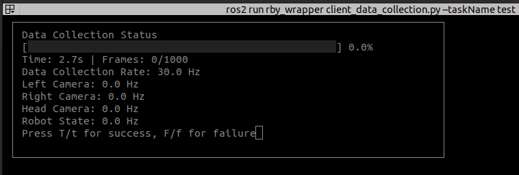
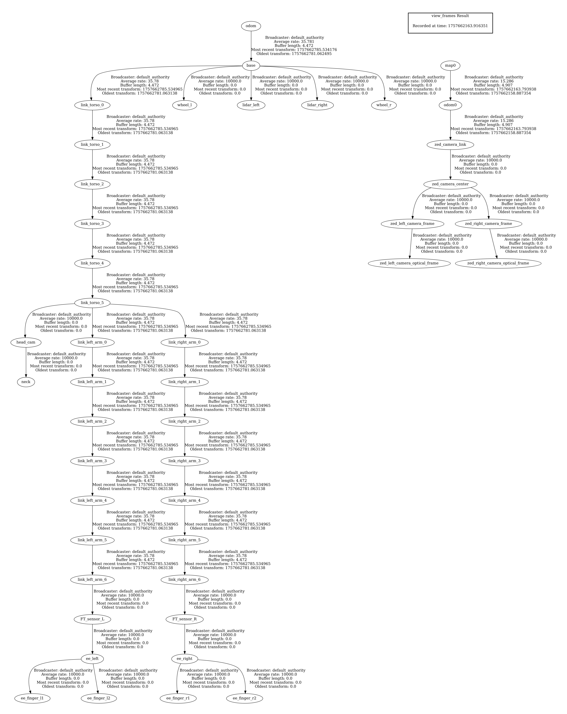
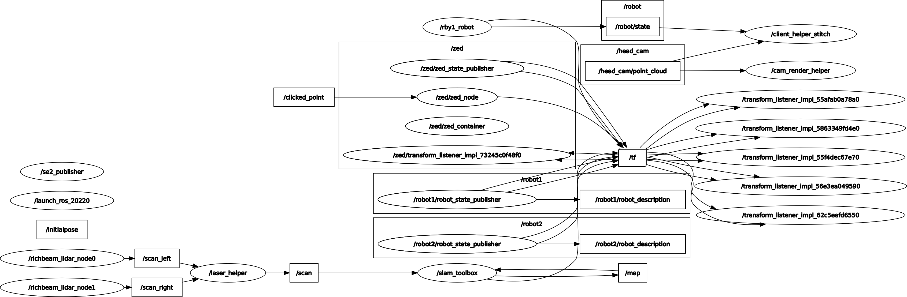
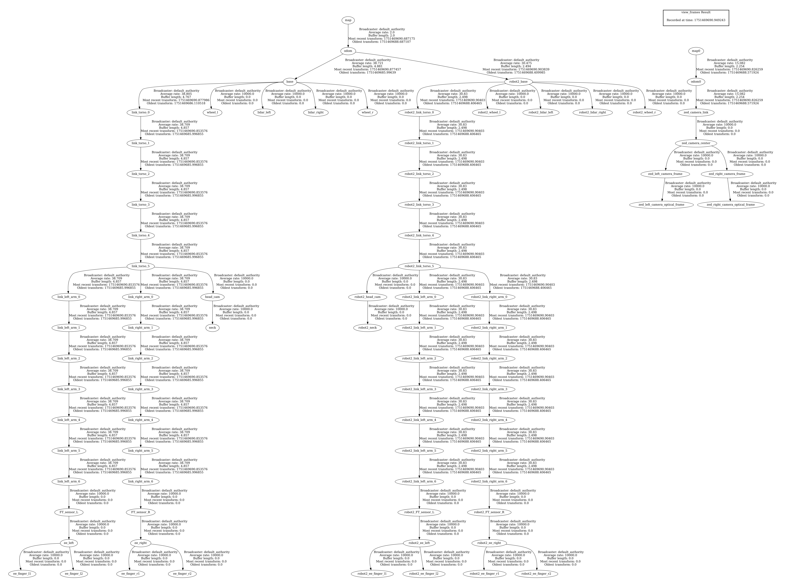
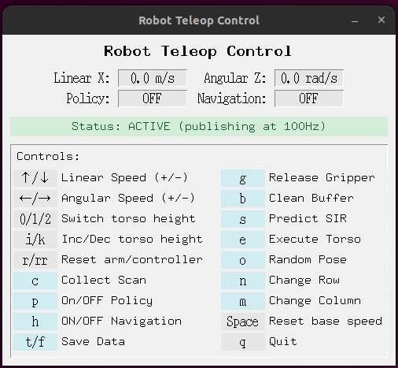

# N2M Real-World Robotics System

This repository provides the full implementation of our real-world experiments. The system is organized with ROS2 (Humble).

<p align="center">
  
  <br>
  <em>Real-world experiments in N2M</em>
</p>

## System Overview

Our system adopts a distributed architecture with two primary components:

### Hardware Settings
- **Desktop (Ubuntu 22.04 LTS)**:
  - High-performance workstation for compute-intensive workloads
  - N2M neural network training and inference
  - Motion planning
  - Manipulation policy training and execution
- **Onboard (Jetson AGX)**:
  - Embedded compute for real-time sensing and control
  - Sensor data acquisition and preprocessing
  - Real-time command execution
  - Low-level robot control interfaces
- **Communication**:
  - Ethernet networking via ROS2 multi-machine communication
- **Mobile Manipulator**:
  - Rainbow Robotics RB-Y1. See the [manual](https://rainbowrobotics.github.io/rby1-dev/) for details.

### ROS Packages
In the real branch under src, we include four ROS packages:

- `lakibeam1`  
  Dual 2D LiDAR driver and fusion. Upstream repository: [Lakibeam_ROS2_Driver](https://github.com/RichbeamTechnology/Lakibeam_ROS2_Driver).  
  Our modifications: cross-LiDAR timestamp synchronization; manual extrinsic calibration of the two 2D LiDARs mounted on the RB-Y1 base; merging both scans into a single point cloud using these extrinsics.

- `realsense-ros`  
  Intel RealSense camera drivers. Upstream repository: [realsense-ros](https://github.com/IntelRealSense/realsense-ros).  
  Our changes: added launch files and updated configs to set initialization parameters; no other changes.

- `zed-ros2-wrapper`  
  ZED camera drivers. Upstream repository: [zed-ros2-wrapper](https://github.com/stereolabs/zed-ros2-wrapper).  
  Our changes: added a new launch file and modified configs to set initialization parameters; no other changes.

- `rby_wrapper`  
  The core package of our real-world system. It includes: a wrapper for RBY1 APIs (wheel odometry, joint states, tf frames, whole-body DoF control interfaces), point cloud stitching and resampling, expert demonstration collection, UI, manipulation interface, N2M interface, and motion planning.
  
  Note 1: the models folder is sourced from Rainbow Robotics’ official repository. Our robot model is rby1a. We fixed a URDF frame relation bug and added a xacro file for batch naming, enabling visualization of both the current robot and predicted poses in RViz via tf (alpha=0.5 for semi-transparency). In the N2M inference tf tree below, prefixes such as __robot2_xxx__ come from this xacro-based batch naming.
  
  Note 2: `rby_wrapper` provides interfaces to plug in a manipulation policy and the N2M network, but does not include their implementations. Train your own manipulation policy (e.g., following [openpi](https://github.com/Physical-Intelligence/openpi) and [diffusion policy](https://github.com/real-stanford/diffusion_policy)) and integrate it afterward; do the same for the N2M network. For N2M training and inference, see the `n2m` branch.

## Prerequisites and Environment Setup

### Python Environment
We use `mamba` for environment management. If not available, use `conda` as a drop-in replacement (substitute `mamba` with `conda`).

```bash
# Create and activate Python environment
mamba create -n rainbow python=3.10
mamba activate rainbow

# Install Python dependencies
pip install -r requirements.txt
```

### ROS2 Workspace Setup

```bash
mkdir ~/workbench
cd ~/workbench

# Clone the repository in both Onboard and DESKTOP
git clone --single-branch --branch real --recurse-submodules https://github.com/clvrai/N2M.git

# Build ROS2 packages on Desktop
colcon build --symlink-install \
  --packages-select realsense2_camera_msgs realsense2_camera realsense2_description \
                    rby_wrapper lakibeam1 zed_ros2 zed_components zed_wrapper \
  --cmake-args -DCMAKE_EXPORT_COMPILE_COMMANDS=YES

# Build ROS2 packages on Onboard
colcon build --symlink-install \
  --packages-select realsense2_camera_msgs realsense2_camera realsense2_description \
                    rby_wrapper lakibeam1 \
  --cmake-args -DCMAKE_EXPORT_COMPILE_COMMANDS=YES
```

## Minimal Effort on Reproduction with ROS Bags
Given the high hardware and sensor requirements to run our code, we provide pre-recorded ROS bags to enable easy reproduction. The task demonstrated is the __Push Chair__ mentioned in comprehensive case 2 of the physical experiments section in our paper. You only need to successfully compile the rby_wrapper package. 

Given the hardware and sensor requirements, we provide pre-recorded ROS bags for easy reproduction. The task is __Push Chair__ from comprehensive case 2 in our paper. You only need to successfully compile the rby_wrapper package.

Download the ros bag from [here](https://drive.google.com/file/d/1oDFGhTyLUM3slYHOhF6KIupTi64HFGt3/view?usp=drive_link).
(_The cloud storage account was specially created for the review and is fully anonymized_)

```bash
# Build required package only
colcon build --symlink-install --packages-select rby_wrapper

# Visualization Only
ros2 launch rby_wrapper multi_robot_display.launch.py

# Play bag files in another terminal
ros2 bag play rotate.db3
ros2 bag play slide.db3
```

<p align="center">
  
  <br>
  <em>ROS Bag Reply</em>
</p>

## Full reproduction of N2M's Real-world experiment

### Step 1: Expert Demonstration Data Collection

This step gathers expert demonstrations via teleoperation for manipulation policy training.

<p align="center">
  
  <br>
  <em>User Inferface for Collecting Expert Demonstrations</em>
</p>

#### Onboard
```bash
cd workbench/N2M

# Launch camera system
zsh launch_cam.sh

# Start teleoperation server
source install/setup.zsh
taskset -c 0,1,2,3 ros2 run rby_wrapper server_teleoperation.py
```

#### Desktop
```bash
cd workbench/N2M

# Source ROS2 environment
source install/setup.zsh

# Start data collection client (replace 'lampRetrieval' with your task name)
ros2 run rby_wrapper client_data_collection.py --taskName lampRetrieval

# optional: Visualize collected data (specify HDF5 file or dataset path)
python utils/data_visualizer.py --hdf5_path <path>

# optional: Verify video frame information
mediainfo --Full video_right.mp4 | grep -i frame
h5dump -H data.h5
```

### Step 2: Rollout Data Collection
This step collects rollouts for N2M training.

<p align="center">
  
  <br>
  <em>TF tree during N2M rollout</em>
</p>

#### Onboard
```bash
# Launch camera system
zsh launch_cam.sh

# Start LiDAR system
source install/setup.zsh
ros2 launch lakibeam1 lakibeam1_scan_dual_lidar.launch.py

# Start robot server
source install/setup.zsh
taskset -c 0,1,2 ros2 run rby_wrapper server_rby1_robot.py
```

#### Desktop
```bash
# Data collection for N2M training
zsh n2m_manager.sh

# N2M inference with SIR (Sequential Importance Resampling) prediction
zsh n2m_manager.sh

# Execute manipulation policy (Follow the instructions in openpi)
mamba activate openpi
zsh run_client_manipulation_policy.sh
```

### Step 3: N2M Inference and Deployment
Inference of the trained N2M model, predicting preferable initial pose for executing manipulation policy.

<p align="center">
  
  <br>
  <em>Rosgraph during N2M inference</em>
</p>


<p align="center">
  
  <br>
  <em>TF tree during N2M inference</em>
</p>

#### Onboard
```bash
# Launch camera system
zsh launch_cam.sh

# Start LiDAR system
source install/setup.zsh
ros2 launch lakibeam1 lakibeam1_scan_dual_lidar.launch.py

# Start robot server
source install/setup.zsh
taskset -c 0,1,2 ros2 run rby_wrapper server_rby1_robot.py
```

#### Desktop
```bash
# Data collection for N2M
zsh n2m_manager.sh

# N2M inference with SIR prediction
zsh n2m_manager.sh --inference

# Execute manipulation policy (Follow the instructions in openpi)
mamba activate openpi
zsh run_client_manipulation_policy.sh
```

## User Interface
We developed a simple UI that publishes specific ROS2 topics through keyboard inputs, enabling robot state transitions via callbacks to achieve specific functionalities. This interface program is invoked when executing the `n2m_manager.sh` script during rollout collection and N2M inference. The UI is shown in the figure below:

<p align="center">
  
  <br>
  <em>User Inferface for Rollout Collection and N2M Inference</em>
</p>

### Rollout Collection
Using the UI, follow these steps to collect rollout data:
1. Launch corresponding code described [above](#Step-2_Rollout_Data_Collection). Click inside the UI window. The Status indicator changes from yellow to green, meaning the UI is **`ACTIVE`**. While **`ACTIVE`**, key inputs send commands to the robot. When the cursor leaves the UI, the Status turns yellow, inputs are ignored, and the robot’s base velocity is set to zero for safety.
2. Use the **`↑/↓/←/→`** arrow keys to control the mobile base’s direction and speed.
3. Use **`0/1/2`** to move the torso to preset heights, or **`i/k`** to fine-tune the torso height.
4. With steps 2 and 3, drive the robot to different poses within the **task area**.
5. Press **`c`** to capture the current ego-centric RGB point cloud. Pressing **`c`** multiple times at different poses will stitch the frames to reconstruct a local scene (in real-world experiments, we typically stitch 2–5 frames from different viewpoints).
6. Use **`↑/↓/←/→`** and **`i/k`** again to move the robot to an initial pose candidate.
7. Press **`p`** to execute the pre-trained **manipulation policy**.
8. Press **`p`** again to stop the manipulation policy.
9. Based on the outcome, press **`t`** (success) or **`f`** (failure) to save this **rollout**. The program records the stitched local scene, the robot’s pose at policy execution (initial pose), and the success/failure label.
10. Press **`b`** to clear the stored scene reconstruction, then manually randomize the scene. Go back to step 2 to start collecting the next **rollout**.

### N2M Inference
Using the UI, follow these steps to run N2M inference:
1. Launch corresponding code described [above](#Step-3_N2M_Inference_and_Deployment). Click inside the UI window. The Status turns from yellow to green (**`ACTIVE`**). While **`ACTIVE`**, key inputs control the robot. When the cursor leaves the UI, the Status turns yellow, inputs are ignored, and the base velocity is zeroed for safety.
2. Press **`o`** to sample a random robot pose within the **task area**; this pose serves as the **navigation end pose**. Press **`h`** to invoke the **motion planning** module so the robot navigates to this pose. Alternatively, use **`↑/↓/←/→`** and **`i/k`** to manually place the robot at any pose, ensuring the target object is visible. The two options are equivalent; we use the former in benchmarks to control evaluation variables and the latter in qualitative evaluations for convenience.
3. Press **`s`** to have the N2M module predict a **preferable initial pose** for executing the **manipulation policy**.
4. Press **`h`** and **`e`** to call the **motion planning** module to move the robot to the predicted pose and align the **torso height** with the prediction.
5. After reaching the predicted pose, press **`h`** to disable navigation.
6. Press **`p`** to execute the pre-trained **manipulation policy**; press **`p`** again to stop. Record the result (success/failure) and manually randomize/reset the scene.
7. Repeat steps 2–6 multiple times to compute the mobile manipulation success rate when bridged by the N2M module.