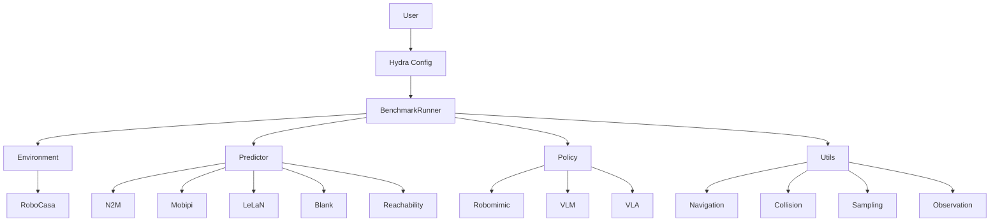
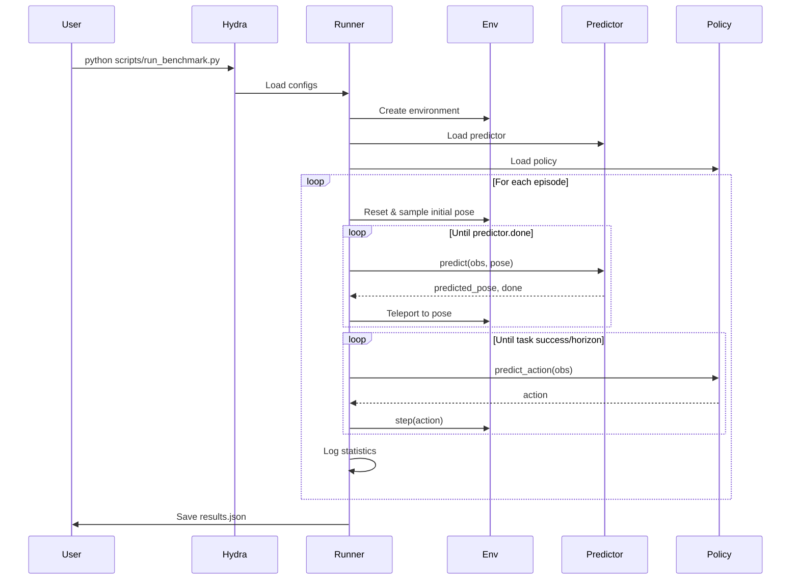

# N2M-Benchmark

Unified benchmark framework for mobile manipulation navigation predictors.

## Overview

This repository provides a benchmark environment for evaluating different navigation prediction methods (N2M, Mobipi, LeLaN, Blank, Reachability) combined with manipulation policies in RoboCasa kitchen environments.

**Key Features:**
- Unified predictor/policy/env interfaces for benchmark
- include 5 predictors: N2M, Mobipi, LeLaN, Blank, Reachability
- Minimal modification to third-party libraries
- Hydra configuration management

## Installation

```bash
mamba create -c conda-forge -n n2m_benchmark python=3.10 -y
mamba activate n2m_benchmark

git clone git@github.com:clvrai/N2M.git -b benchmark N2M_benchmark
cd N2M_benchmark

chmod +x install.sh
./install.sh    # it is ok to have pip packages conflicts.
```

## Prepare Policy

### Policy1: Robomimic

**Download datasets**
Download robocasa pre-collected dataset for policy training and inference
```bash
cd env/robocasa
python robocasa/scripts/my_download_datasets.py --ds_types mg_im --tasks PnPCounterToCab --download_dir ../../data/policy/robomimic/datasets
python robocasa/scripts/my_download_datasets.py --ds_types mg_im --tasks CloseDoubleDoor --download_dir ../../data/policy/robomimic/datasets
python robocasa/scripts/my_download_datasets.py --ds_types mg_im --tasks OpenSingleDoor --download_dir ../../data/policy/robomimic/datasets
python robocasa/scripts/my_download_datasets.py --ds_types mg_im --tasks CloseDrawer --download_dir ../../data/policy/robomimic/datasets
```
**Train policies**
You can train yourself, or use our pre-trained policy checkpoints. 
<details>
<summary>Click to expand training commands</summary>

```bash
cd policy/robomimic

# PnPCounterToCab - BC Transformer
python robomimic/scripts/train.py --config ../../data/policy/robomimic/configs/pnpCounterToCab_BCtransformer.json

# PnPCounterToCab - Diffusion
python robomimic/scripts/train.py --config ../../data/policy/robomimic/configs/PnPCounterToCab_diffusion.json

# CloseDoubleDoor - BC Transformer
python robomimic/scripts/train.py --config ../../data/policy/robomimic/configs/CloseDoubleDoor_BCtransformer.json

# CloseDoubleDoor - Diffusion
python robomimic/scripts/train.py --config ../../data/policy/robomimic/configs/CloseDoubleDoor_diffusion.json

# OpenSingleDoor - BC Transformer
python robomimic/scripts/train.py --config ../../data/policy/robomimic/configs/OpenSingleDoor_BCtransformer.json

# OpenSingleDoor - Diffusion
python robomimic/scripts/train.py --config ../../data/policy/robomimic/configs/OpenSingleDoor_diffusion.json

# CloseDrawer - BC Transformer
python robomimic/scripts/train.py --config ../../data/policy/robomimic/configs/CloseDrawer_BCtransformer.json

# CloseDrawer - Diffusion
python robomimic/scripts/train.py --config ../../data/policy/robomimic/configs/CloseDrawer_diffusion.json
```
</details>

Policy checkpoints should be placed as follows:
```
data/policy/robomimic/checkpoints/
├── pnpCounterToCab_BCtransformer.pth
├── PnPCounterToCab_diffusion.pth
├── CloseDoubleDoor_BCtransformer.pth
├── CloseDoubleDoor_diffusion.pth
├── OpenSingleDoor_BCtransformer.pth
├── OpenSingleDoor_diffusion.pth
├── CloseDrawer_BCtransformer.pth
└── CloseDrawer_diffusion.pth
```

### Policy2: VLM
Todo

### Policy3: VLA
Todo

## Prepare Predictors

### Predictor1: N2M

Collect Policy rollout for N2M training
```bash
# name: [CloseDrawer, PnPCounterToCab, CloseDoubleDoor, OpenSingleDoor]
# policy: [bc_transformer, diffusion]
CUDA_VISIBLE_DEVICES=6 python scripts/collect_n2m_data.py \
  env.name=OpenSingleDoor \
  policy=diffusion \
  benchmark=collection \
  benchmark.num_valid_data=50

CUDA_VISIBLE_DEVICES=7 python scripts/collect_n2m_data.py \
  env.name=PnPCounterToCab \
  policy=diffusion \
  benchmark=collection \
  benchmark.num_valid_data=50

CUDA_VISIBLE_DEVICES=0 python scripts/collect_n2m_data.py \
  env.name=CloseDoubleDoor \
  env.render=true \
  policy=bc_transformer \
  benchmark=collection \
  benchmark.num_valid_data=3
```

Output format:
```
data/predictor/n2m/{task}_{scene}_{style}_{policytype}/
├── pcl/
│   ├── 0.pcd
│   ├── 1.pcd
│   └── ...
└── meta.json  # camera info, pose with pcd_path
```


Train N2M module
```bash
cd predictor/N2M/scripts/render
mkdir build && cd build
cmake .. && make -j && cd ../../../../..
python predictor/N2M/scripts/sample_camera_poses.py --dataset_path data/predictor/n2m/OpenSingleDoor_0_1_diffusion --num_poses 300 --vis --num_episodes 20

# debug
python predictor/N2M/scripts/sample_camera_poses.py --dataset_path data/predictor/n2m/OpenSingleDoor_0_1_diffusion --num_poses 10 --vis --num_episodes 2
python predictor/N2M/scripts/sample_camera_poses.py --dataset_path ../lamp --num_poses 100 --vis --num_episodes 1

scripts/render/build/fpv_render data/predictor/n2m/OpenSingleDoor_0_1_diffusion

```


### Predictor2: Mobipi (todo)

**Collect Mobipi images (TODO)**
```bash
python scripts/collect_mobipi_images.py \
  env=CloseDrawer \
  benchmark=data_collection
```

### Predictor3: LeLaN (todo)

Todo


## Run Benchmark Evaluation

**Basic usage:**
```bash
# name: [CloseDrawer, PnPCounterToCab, CloseDoubleDoor, OpenSingleDoor]
# policy: [bc_transformer, diffusion]

# Using BC Transformer policy for PnPCounterToCab with blank predictor
CUDA_VISIBLE_DEVICES=0 python scripts/run_benchmark.py \
  env.name=CloseDrawer \
  env.render=true \
  policy=bc_transformer \
  predictor=blank \
  benchmark=evaluation \
  benchmark.num_episodes=3

# Using Diffusion policy for CloseDrawer with blank predictor
CUDA_VISIBLE_DEVICES=0 python scripts/run_benchmark.py \
  env.name=CloseDrawer \
  policy=diffusion \
  predictor=blank \
  benchmark=evaluation \
  benchmark.num_episodes=50

# Control rendering and scene layout
CUDA_VISIBLE_DEVICES=0 python scripts/run_benchmark.py \
  env.name=OpenSingleDoor \
  env.render=false \
  env.layout_and_style_ids='[[1,2]]' \
  policy=bc_transformer \
  predictor=blank \
  benchmark=evaluation
```

## Troubleshooting

### OpenGL/GLFW Rendering Issues

If you encounter errors like:
```
libGL error: MESA-LOADER: failed to open swrast: /lib/x86_64-linux-gnu/libLLVM-12.so.1: undefined symbol: ffi_type_sint32
GLFWError: (65543) b'GLX: Failed to create context: BadValue (integer parameter out of range for operation)'
ERROR: could not create window
```
Try following steps
```bash
sudo apt install mlocate
locate libglfw.so.3
# Create soft link libglfw.so.3 you found to /usr/local/lib/
sudo cp /usr/lib/x86_64-linux-gnu/libglfw.so.3 /usr/local/lib/

export LD_PRELOAD=/usr/lib/x86_64-linux-gnu/libffi.so.7
```

## Project Structure
### Folder Structure
```
N2M-benchmark/
├── benchmark/                      # Main benchmark package
│   ├── core/                       # Core benchmark logic
│   │   ├── benchmark_runner.py    # Multi-episode runner
│   │   ├── data_collector.py      # N2M data collection
│   │   └── rollout.py             # Unified rollout loop
│   ├── env/                        # Environment utilities
│   │   └── env_utils.py           # Env creation, config loading
│   ├── policy/                     # Policy wrappers
│   │   ├── base.py                # BasePolicy interface
│   │   ├── robomimic_policy.py    # Robomimic policy wrapper
│   │   ├── vlm_policy.py          # VLM policy wrapper
│   │   └── vla_policy.py          # VLA policy wrapper
│   ├── predictor/                  # Predictor implementations
│   │   ├── base.py                # BasePredictor interface
│   │   ├── blank_predictor.py     # Baseline (no prediction)
│   │   ├── n2m_predictor.py       # N2M predictor
│   │   ├── mobipi_predictor.py    # Mobipi predictor
│   │   ├── lelan_predictor.py     # LeLaN predictor
│   │   └── reachability_predictor.py # Reachability predictor
│   └── utils/                      # Utility modules
│       ├── collision_utils.py     # Collision checking
│       ├── navigation_utils.py    # Teleport navigation
│       ├── obs_utils.py           # Observation extraction
│       ├── observation_utils.py   # RGB-D → point cloud
│       ├── sample_utils.py        # Pose sampling
│       ├── sampling_utils.py      # Target sampling
│       ├── transform_utils.py     # SE2/SE3 transforms
│       └── visualization_utils.py # Video/plot generation
├── configs/                        # Hydra configurations
│   ├── config.yaml                # Main entry point
│   ├── paths/                     # Path configurations
│   │   └── default.yaml           # Data/checkpoint paths
│   ├── env/                       # Environment configs
│   │   ├── configs/               # JSON configs (robosuite)
│   │   │   ├── CloseDrawer.json
│   │   │   ├── CloseDoubleDoor.json
│   │   │   ├── OpenSingleDoor.json
│   │   │   └── PnPCounterToCab.json
│   │   └── robocasa.yaml          # Universal RoboCasa config
│   ├── policy/                    # Policy configs
│   │   ├── configs/               # JSON configs (robomimic)
│   │   │   ├── CloseDrawer_BCtransformer.json
│   │   │   ├── CloseDrawer_diffusion.json
│   │   │   ├── CloseDoubleDoor_BCtransformer.json
│   │   │   ├── CloseDoubleDoor_diffusion.json
│   │   │   ├── OpenSingleDoor_BCtransformer.json
│   │   │   ├── OpenSingleDoor_diffusion.json
│   │   │   ├── pnpCounterToCab_BCtransformer.json
│   │   │   └── PnPCounterToCab_diffusion.json
│   │   ├── bc_transformer.yaml    # BC Transformer config
│   │   └── diffusion.yaml         # Diffusion policy config
│   ├── predictor/                 # Predictor configs
│   │   ├── blank.yaml
│   │   ├── n2m.yaml
│   │   ├── mobipi.yaml
│   │   ├── lelan.yaml
│   │   └── reachability.yaml
│   └── benchmark/                 # Benchmark mode configs
│       ├── collection.yaml        # Data collection mode
│       └── evaluation.yaml        # Evaluation mode
├── data/                           # Data storage (gitignored)
│   ├── policy/                    # Policy checkpoints and datasets
│   │   └── robomimic/
│   │       ├── checkpoints/       # Trained policy checkpoints
│   │       └── datasets/          # Training datasets
│   ├── predictor/                 # Predictor data
│   │   └── n2m/                   # N2M training data
│   │       └── {task}_{layout}_{style}_{policy}/
│   │           ├── pcl/           # Point cloud files
│   │           │   ├── 0.pcd
│   │           │   ├── 1.pcd
│   │           │   └── ...
│   │           └── meta.json      # Metadata (poses, camera params)
│   └── benchmark/                 # Benchmark results
│       └── results/
├── env/                            # Environment submodules
│   ├── robocasa/                  # RoboCasa environment
│   ├── robosuite/                 # Robosuite simulator
│   └── mimicgen/                  # MimicGen
├── policy/                         # Policy submodules
│   └── robomimic/                 # Robomimic policy library
├── predictor/                      # Predictor submodules
│   ├── N2M/                       # N2M predictor
│   ├── mobipi/                    # Mobipi predictor
│   ├── lelan/                     # LeLaN predictor
│   ├── blank/                     # Blank predictor (placeholder)
│   └── reachability/              # Reachability predictor
├── scripts/                        # Executable scripts
│   ├── collect_n2m_data.py        # Collect N2M training data
│   ├── collect_mobipi_images.py   # Collect Mobipi images
│   └── run_benchmark.py           # Run benchmark evaluation
├── docs/                           # Documentation
│   └── RENDERING_ISSUES.md        # Troubleshooting guide
├── install.sh                      # Installation script
├── pyproject.toml                  # Package configuration
└── README.md
```


### System Architecture



### Workflow



## Configuration Architecture

### Configuration Structure

```
configs/
├── env/
│   ├── configs/              # Environment JSON configs (complete robosuite configs)
│   │   ├── CloseDrawer.json
│   │   ├── PnPCounterToCab.json
│   │   └── ...
│   └── robocasa.yaml         # Universal RoboCasa environment config
│
├── policy/
│   ├── configs/              # Policy JSON configs (complete robomimic configs)
│   │   ├── CloseDrawer_BCtransformer.json
│   │   ├── CloseDrawer_diffusion.json
│   │   └── ...
│   ├── bc_transformer.yaml   # BC Transformer policy
│   └── diffusion.yaml        # Diffusion policy
│
├── predictor/                # Predictor configs
│   ├── n2m.yaml
│   ├── mobipi.yaml
│   └── ...
│
└── benchmark/                # Benchmark mode configs
    ├── collection.yaml
    └── evaluation.yaml
```

### Configuration Resolution

```
config.yaml
  └─> env/robocasa.yaml (env.name specified via command line)
       ├─> configs/env/configs/${env.name}.json (full env config)
       └─> policy/bc_transformer.yaml (auto-constructs config_name from env.name)
            └─> configs/policy/configs/${env.name}_BCtransformer.json (full policy config)
```

