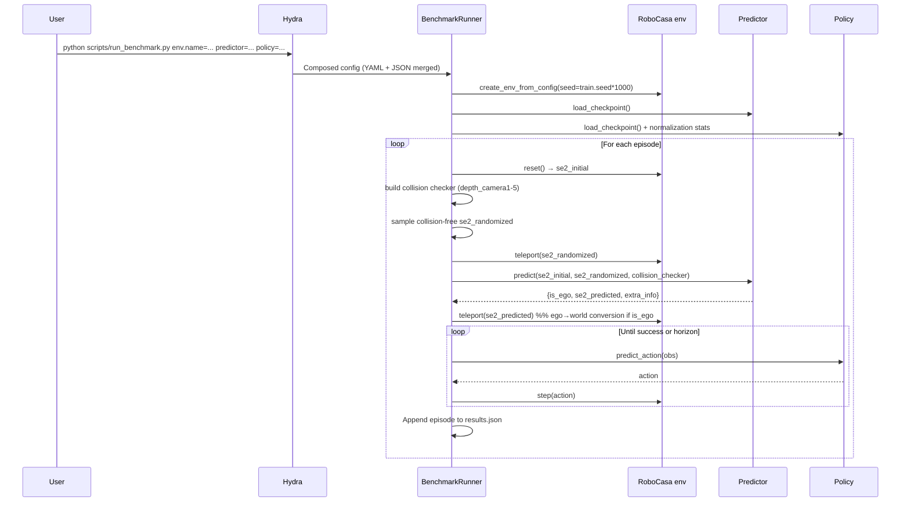

# N2M-Benchmark

Unified benchmark framework for mobile manipulation navigation predictors.

## Overview

This repository provides a benchmark environment for evaluating different navigation prediction methods (N2M, Mobipi, Reachability, Oracle) combined with manipulation policies in RoboCasa kitchen environments.

**Key Features:**

- Unified predictor/policy/env interfaces for benchmark
- include 4 predictors: N2M, Mobipi, Reachability, Oracle
- Minimal modification to third-party libraries
- Hydra configuration management

## Current Status

- The repository has been synchronized with the latest benchmark code.
- The pretrained assets used by the benchmark have been uploaded and are available through the prepared `data/` folder linked below.
- The benchmark result files used for the paper's benchmark statistics have also been uploaded; the download link is provided in the evaluation section below.
- TODO: We have not yet re-cloned the repository from GitHub and run through the README from scratch to verify the full setup flow end-to-end. There may still be small setup bugs. We plan to finish this final check before May 15, 2026.

## Installation

```bash
mamba create -c conda-forge -n n2m_benchmark python=3.10 -y
mamba activate n2m_benchmark

git clone git@github.com:clvrai/N2M.git -b benchmark N2M_benchmark
cd N2M_benchmark

echo "alias n2m_ws='cd $(pwd)'" >> ~/.${SHELL##*/}rc && source ~/.${SHELL##*/}rc

chmod +x install.sh
./install.sh    # it is ok to have pip packages conflicts.
```

## Download Prepared Data

We provide a prepared `data/` folder that contains the pretrained assets used by the benchmark, including pretrained manipulation policies, pretrained N2M models, and the CloseDrawer Mobipi 3DGS reconstruction.

Download link: https://drive.google.com/drive/folders/1lRb42oNca6Eiiu7QzvDSpTC61Rxrt3H4?usp=drive_link

Download and extract this folder **before** downloading the RoboCasa datasets below. The prepared folder creates `data/` in the repository root.


This prepared `data/` folder does **not** include the RoboCasa policy datasets because they are too large to bundle with the pretrained assets. You still need to download the datasets manually in the next section. They are required for inference as well as training.

## Prepare Policy

### Policy1: Robomimic

**Download datasets**
Download RoboCasa pre-collected datasets for policy training and inference. This step is required even if you use the pretrained checkpoints.

```bash
n2m_ws

python env/robocasa/robocasa/scripts/my_download_datasets.py --ds_types mg_im --tasks PnPCounterToCab --download_dir data/policy/robomimic/datasets
python env/robocasa/robocasa/scripts/my_download_datasets.py --ds_types mg_im --tasks CloseDoubleDoor --download_dir data/policy/robomimic/datasets
python env/robocasa/robocasa/scripts/my_download_datasets.py --ds_types mg_im --tasks OpenSingleDoor --download_dir data/policy/robomimic/datasets
python env/robocasa/robocasa/scripts/my_download_datasets.py --ds_types mg_im --tasks CloseDrawer --download_dir data/policy/robomimic/datasets
```

**Train policies**
You can train yourself, or use our pre-trained policy checkpoints. 

**Use pretrained checkpoints**
If you do not want to train the manipulation policies yourself, use the prepared `data/` folder linked above. It already contains the pretrained policy checkpoints used by the benchmark.

Click to expand training commands

```bash
n2m_ws

# PnPCounterToCab - BC Transformer
python policy/robomimic/robomimic/scripts/train.py --config data/policy/robomimic/configs/pnpCounterToCab_BCtransformer.json

# PnPCounterToCab - Diffusion
python policy/robomimic/robomimic/scripts/train.py --config data/policy/robomimic/configs/PnPCounterToCab_diffusion.json

# CloseDoubleDoor - BC Transformer
python policy/robomimic/robomimic/scripts/train.py --config data/policy/robomimic/configs/CloseDoubleDoor_BCtransformer.json

# CloseDoubleDoor - Diffusion
python policy/robomimic/robomimic/scripts/train.py --config data/policy/robomimic/configs/CloseDoubleDoor_diffusion.json

# OpenSingleDoor - BC Transformer
python policy/robomimic/robomimic/scripts/train.py --config data/policy/robomimic/configs/OpenSingleDoor_BCtransformer.json

# OpenSingleDoor - Diffusion
python policy/robomimic/robomimic/scripts/train.py --config data/policy/robomimic/configs/OpenSingleDoor_diffusion.json

# CloseDrawer - BC Transformer
python policy/robomimic/robomimic/scripts/train.py --config data/policy/robomimic/configs/CloseDrawer_BCtransformer.json

# CloseDrawer - Diffusion
python policy/robomimic/robomimic/scripts/train.py --config data/policy/robomimic/configs/CloseDrawer_diffusion.json
```

Policy checkpoints should be placed as follows. BC Transformer checkpoints are loaded from `data/policy/robomimic/checkpoints/`, and diffusion checkpoints are loaded from `data/policy/dp/checkpoints/`.

```
data/policy/
├── robomimic/checkpoints/
│   ├── PnPCounterToCab_BCtransformer.pth
│   ├── CloseDoubleDoor_BCtransformer.pth
│   ├── OpenSingleDoor_BCtransformer.pth
│   └── CloseDrawer_BCtransformer.pth
└── dp/checkpoints/
    ├── PnPCounterToCab_diffusion.pth
    ├── CloseDoubleDoor_diffusion.pth
    ├── OpenSingleDoor_diffusion.pth
    └── CloseDrawer_diffusion.pth
```

### Policy2: VLM

Not implemented — we planned to include a Vision-Language Model baseline but ran out of time before the deadline. The interface is already in place, so users can plug one in without touching the runner: subclass `BasePolicy` (see `benchmark/policy/base.py`) and replace the stub at `benchmark/policy/vlm_policy.py`. The required methods are `predict_action(observation, goal=None) -> np.ndarray`, `reset()`, `load_checkpoint(path)`, and the `name` property.

### Policy3: VLA

Not implemented — same story as VLM. The stub lives at `benchmark/policy/vla_policy.py` and follows the exact same `BasePolicy` contract; finish those four methods and wire it into `scripts/run_benchmark.py` alongside the existing `cfg.policy.type == "robomimic" / "diffusion"` branches.

## Prepare Predictors

### Predictor1: N2M

Collect Policy rollout for N2M training

```bash
# name: [CloseDrawer, PnPCounterToCab, CloseDoubleDoor, OpenSingleDoor]
# policy: [bc_transformer, diffusion]
python scripts/collect_n2m_data.py \
  env.name=CloseDrawer \
  env.render=false \
  'env.layout_and_style_ids=[[0,0]]' \
  policy=diffusion \
  benchmark=collection \
  benchmark.num_valid_data=50

python scripts/collect_n2m_data.py \
  env.name=CloseDrawer \
  env.render=false \
  'env.layout_and_style_ids=[[0,0]]' \
  policy=bc_transformer \
  benchmark=collection \
  benchmark.num_valid_data=50
```

Output format:

```
data/predictor/n2m/{task}_{scene}_{style}_{policytype}/
├── pcl/
│   ├── 0.pcd
│   ├── 1.pcd
│   └── ...
└── meta.json  # camera info, pose with pcd_path
```

Data augmentation and Train N2M module

**Use pretrained N2M checkpoints**
If you do not want to collect rollouts and train N2M yourself, use the prepared `data/` folder linked above. It already contains the pretrained N2M folders used by the benchmark.

Place each folder under `data/predictor/n2m/`. For example:

```
data/predictor/n2m/CloseDrawer_0_0_diffusion_50/
└── training/
    ├── config.json
    └── ckpts/best_model.pth

data/predictor/n2m/CloseDrawer_0_0_bc_transformer_50/
└── training/
    ├── config.json
    └── ckpts/best_model.pth
```

```bash
# compile the render (c++ based for rending speed.) (Introduced in Section 3.3.2 in our paper)
cd predictor/N2M/scripts/render
mkdir build && cd build
cmake .. && make -j
n2m_ws

# diffusion
python predictor/N2M/scripts/sample_camera_poses.py --dataset_path data/predictor/n2m/CloseDrawer_0_0_diffusion_50 --num_poses 300 --num_episodes 50

predictor/N2M/scripts/render/build/fpv_render data/predictor/n2m/CloseDrawer_0_0_diffusion_50 
python predictor/N2M/scripts/train.py --use_cache --max_epoch 800 --num_gaussians 2 --dataset_path data/predictor/n2m/CloseDrawer_0_0_diffusion_50 --encoder_ckpt data/predictor/n2m/PointBERT/PointTransformer_ModelNet8192points.pth


# bc_transformer
python predictor/N2M/scripts/sample_camera_poses.py --dataset_path data/predictor/n2m/CloseDrawer_0_0_bc_transformer_50 --num_poses 300 --num_episodes 50

predictor/N2M/scripts/render/build/fpv_render data/predictor/n2m/CloseDrawer_0_0_bc_transformer_50 64
python predictor/N2M/scripts/train.py --use_cache --max_epoch 800 --num_gaussians 2 --dataset_path data/predictor/n2m/CloseDrawer_0_0_bc_transformer_50 --encoder_ckpt data/predictor/n2m/PointBERT/PointTransformer_ModelNet8192points.pth
```

### Predictor2: Mobipi

Reconstruct the scene in mobipi their own repo (6m57s for each reconstruction, including 83s for capture image and pcd. 3dgs with ground truth transform_matrix and pcd.)

```bash
python mobipi/scene_model/collect_images.py --env_name CloseDrawer --layout_id 0 --style_id 0 --seed 123000
```

or use the pre-collected CloseDrawer 3DGS reconstruction included in the prepared `data/` folder linked above.

Place it under:

```
data/predictor/mobipi/scene_data/close_drawer/layout0_style0_seed123000/
└── model/splatfacto/.../nerfstudio_models/step-*.ckpt
```

### Predictor3: Reachability

We ship a **rigorous IK-based reachability baseline**. A previous reachability baseline of ours was criticized by reviewers as not strict enough, so for this benchmark we sample a candidate base pose, then explicitly run IK on the Panda arm to verify the robot can reach the target manipulation surface *before and after* the task is executed. If both checks pass, the pose is accepted. Implementation lives in `benchmark/predictor/reachability_predictor.py` and uses [pinocchio](https://github.com/stack-of-tasks/pinocchio) plus the Panda URDF loaded via `robot_descriptions`.

**Two implementations exist** (only the first is in this branch):

1. **Strict IK** (this branch) — sample a base pose → IK-check reachability of pre-/post-task end-effector targets on the drawer surface. Guarantees reachability but is **tailored to the `CloseDrawer` task only** (target surfaces are hard-coded in `reachability_predictor.py`). A cleaner approach would be to precompute an *inverse reachability map* and query it on the fly; we chose the naive online sampler because it's easy to verify and gives a fair point of comparison for this benchmark. Apologies for the rough edges.
2. **Simplified distance heuristic** (`sim` branch, **not in this benchmark branch**) — accept a base pose iff `distance(target, arm_base) > 0.9 × arm_length`. Numerically almost identical to the strict version and applicable to *all* tasks (not just `CloseDrawer`). This is the version reported in Figure 5 and Figure 10 of our ICML camera-ready paper.

```bash
python scripts/run_benchmark.py \
  env.name=CloseDrawer 'env.layout_and_style_ids=[[0,0]]' \
  policy=bc_transformer predictor=reachability \
  benchmark=evaluation benchmark.num_episodes=300
```

### Predictor4: Oracle

The Oracle baseline is `**OraclePredictor**` (`benchmark/predictor/oracle_predictor.py`, CLI override `predictor=oracle`). It returns `se2_initial` directly — the unperturbed initial pose from `env.reset()`, which matches the pose distribution the manipulation policy was trained on. So it answers: *"how well does the policy do if you give it the training-time canonical pose for free?"* — an upper bound that isolates manipulation difficulty from navigation difficulty. No checkpoint or extra setup required.

### Predictor5: LeLaN (todo)

Not implemented in this branch. LeLaN is a **VLM-based navigation policy** used as a navigation predictor baseline in the Mobipi paper — given a natural-language target description, it predicts a base pose to drive toward. Source for the model lives in the `[predictor/lelan/](predictor/lelan/)` submodule. The integration scaffolding (`benchmark/predictor/lelan_predictor.py` + `configs/predictor/lelan.yaml`) is in place, but we ran out of time before the deadline to finish the wrapper. Contributors who want to enable it can fill in `LeLaNPredictor.predict()` against the model API documented in `predictor/lelan/README.md`.

## Run Benchmark Evaluation

We also release one set of benchmark statistics computed from 300 consecutive runs, corresponding to the benchmark results reported in the paper:

https://drive.google.com/drive/folders/1qPjI9FdSEAifqHznYgRZOjvHC9zO6nIm?usp=drive_link

**Basic usage:**

```bash
# name: [CloseDrawer, PnPCounterToCab, CloseDoubleDoor, OpenSingleDoor]
# policy: [bc_transformer, diffusion]
# predictor: [oracle, n2m, mobipi, reachability]

# oracle
python scripts/run_benchmark.py \
  env.name=CloseDrawer \
  env.render=false \
  'env.layout_and_style_ids=[[0,0]]' \
  policy=diffusion \
  predictor=oracle \
  benchmark=evaluation \
  benchmark.num_episodes=300

python scripts/run_benchmark.py \
  env.name=CloseDrawer \
  env.render=false \
  'env.layout_and_style_ids=[[0,0]]' \
  policy=bc_transformer \
  predictor=oracle \
  benchmark=evaluation \
  benchmark.num_episodes=300

# n2m (we tried rollout_num = 20,35,50. They all works reasonable.)
python scripts/run_benchmark.py \
  env.name=CloseDrawer \
  env.render=false \
  'env.layout_and_style_ids=[[0,0]]' \
  policy=diffusion \
  predictor=n2m \
  predictor.rollout_num=50 \
  benchmark=evaluation \
  benchmark.num_episodes=300

python scripts/run_benchmark.py \
  env.name=CloseDrawer \
  env.render=false \
  'env.layout_and_style_ids=[[0,0]]' \
  policy=bc_transformer \
  predictor=n2m \
  predictor.rollout_num=50 \
  benchmark=evaluation \
  benchmark.num_episodes=300

# mobipi 
python scripts/run_benchmark.py \
  env.name=CloseDrawer \
  env.render=false \
  'env.layout_and_style_ids=[[0,0]]' \
  policy=bc_transformer \
  predictor=mobipi \
  predictor.num_init_samples=2500 \
  predictor.bo_num_samples=500 \
  benchmark=evaluation \
  benchmark.num_episodes=300

python scripts/run_benchmark.py \
  env.name=CloseDrawer \
  env.render=false \
  'env.layout_and_style_ids=[[0,0]]' \
  policy=diffusion \
  predictor=mobipi \
  predictor.num_init_samples=2500 \
  predictor.bo_num_samples=505 \
  benchmark=evaluation \
  benchmark.num_episodes=300

# reachability
python scripts/run_benchmark.py \
  env.name=CloseDrawer \
  env.render=false \
  'env.layout_and_style_ids=[[0,0]]' \
  policy=diffusion \
  predictor=reachability \
  benchmark=evaluation \
  benchmark.num_episodes=300

python scripts/run_benchmark.py \
  env.name=CloseDrawer \
  env.render=false \
  'env.layout_and_style_ids=[[0,0]]' \
  policy=bc_transformer \
  predictor=reachability \
  benchmark=evaluation \
  benchmark.num_episodes=300
```

## Troubleshooting

### OpenGL/GLFW Rendering Issues

If you encounter errors like:

```
libGL error: MESA-LOADER: failed to open swrast: /lib/x86_64-linux-gnu/libLLVM-12.so.1: undefined symbol: ffi_type_sint32
GLFWError: (65543) b'GLX: Failed to create context: BadValue (integer parameter out of range for operation)'
ERROR: could not create window
```

Try following steps

```bash
sudo apt install mlocate
locate libglfw.so.3
# Create soft link libglfw.so.3 you found to /usr/local/lib/
sudo cp /usr/lib/x86_64-linux-gnu/libglfw.so.3 /usr/local/lib/

export LD_PRELOAD=/usr/lib/x86_64-linux-gnu/libffi.so.7
```

## Project Structure

### Repo layout

```
N2M-benchmark/
├── benchmark/                          # Integration layer (this repo's source)
│   ├── core/
│   │   ├── benchmark_runner.py        # Multi-episode runner with resume + incremental save
│   │   ├── data_collector.py          # N2M training data collection
│   │   └── rollout.py                 # Per-episode predict → teleport → manipulate loop
│   ├── env/env_utils.py               # RoboCasa env creation from JSON config
│   ├── policy/                        # Policy wrappers (subclass BasePolicy)
│   │   ├── base.py                    # BasePolicy abstract class
│   │   ├── robomimic_policy.py        # BC Transformer / Diffusion via robomimic
│   │   ├── vlm_policy.py              # Stub — NotImplementedError
│   │   └── vla_policy.py              # Stub — NotImplementedError
│   ├── predictor/                     # Predictor wrappers (subclass BasePredictor)
│   │   ├── base.py
│   │   ├── oracle_predictor.py        # Upper-bound baseline (returns training-distribution pose)
│   │   ├── n2m_predictor.py           # Point cloud → GMM → SE2
│   │   ├── mobipi_predictor.py        # 3DGS + Bayesian Optimization
│   │   ├── lelan_predictor.py         # Stub
│   │   └── reachability_predictor.py  # IK reachability (pinocchio)
│   └── utils/                         # Collision, sampling, observation, transform helpers
│
├── configs/                            # Hydra configurations (YAML composition + JSON details)
│   ├── config.yaml                    # Top-level: composes paths/env/policy/predictor/benchmark
│   ├── paths/default.yaml             # Data and checkpoint root paths
│   ├── env/
│   │   ├── robocasa.yaml              # Universal env YAML; interpolates env.name into JSON path
│   │   └── configs/                   # Full robosuite/robocasa JSON configs (one per task)
│   │       ├── CloseDrawer.json
│   │       ├── CloseDoubleDoor.json
│   │       ├── OpenSingleDoor.json
│   │       └── PnPCounterToCab.json
│   ├── policy/
│   │   ├── bc_transformer.yaml        # auto-builds config_name from env.name
│   │   ├── diffusion.yaml
│   │   └── configs/                   # Full robomimic JSON configs (one per task × policy)
│   │       ├── CloseDrawer_BCtransformer.json
│   │       ├── CloseDrawer_diffusion.json
│   │       ├── CloseDoubleDoor_BCtransformer.json
│   │       ├── OpenSingleDoor_BCtransformer.json
│   │       └── pnpCounterToCab_BCtransformer.json
│   ├── predictor/                     # One YAML per predictor (oracle/n2m/mobipi/lelan/reachability)
│   └── benchmark/
│       ├── collection.yaml            # Data-collection mode (asserted by collect_n2m_data.py)
│       └── evaluation.yaml            # Evaluation mode (asserted by run_benchmark.py)
│
├── scripts/
│   ├── run_benchmark.py               # Main evaluation entry point
│   ├── collect_n2m_data.py            # Collect N2M training data via base-policy rollouts
│   └── collect_mobipi_images.py       # Collect multi-view images for mobipi 3DGS training
│
├── data/                               # External assets, datasets, checkpoints, and results
│   ├── policy/
│   │   ├── robomimic/
│   │   │   ├── checkpoints/           # BC Transformer policy checkpoints
│   │   │   └── datasets/              # RoboCasa datasets used by BC Transformer
│   │   └── dp/
│   │       ├── checkpoints/           # Diffusion policy checkpoints
│   │       └── datasets/              # Datasets used by diffusion policies
│   ├── predictor/
│   │   ├── n2m/
│   │   │   ├── PointBERT/             # PointBERT encoder checkpoint
│   │   │   └── {task}_{layout}_{style}_{policy}_{rollout_num}/
│   │   │       ├── pcl/               # Collected point clouds for N2M training
│   │   │       ├── meta.json          # Pose and point-cloud metadata
│   │   │       └── training/
│   │   │           ├── config.json
│   │   │           └── ckpts/best_model.pth
│   │   └── mobipi/
│   │       └── scene_data/
│   │           └── close_drawer/
│   │               └── layout0_style0_seed123000/
│   │                   └── model/splatfacto/.../nerfstudio_models/step-*.ckpt
│   └── benchmark/results/             # JSON results, one per (task × predictor) run
│
├── env/                                # Submodules — installed editable by install.sh
│   ├── robocasa/                      # RoboCasa kitchen envs
│   ├── robosuite/                     # MuJoCo simulator wrapper
│   └── mimicgen/                      # MimicGen demos
├── policy/robomimic/                  # Robomimic submodule
├── predictor/                          # Predictor submodules (heavy algo code)
│   ├── N2M/
│   ├── mobipi/
│   ├── lelan/
│   └── reachability/
│
├── install.sh                          # Pip-installs submodules + pins nerfstudio/numpy/timm
├── pyproject.toml                      # Benchmark package metadata + optional extras
├── CLAUDE.md                           # Notes for AI coding assistants on cross-file invariants
└── README.md
```

### Hydra config resolution

Two layers: the small **YAML files** compose Hydra groups and interpolate paths; the heavy **JSON files** under `configs/env/configs/` and `configs/policy/configs/` carry the full robosuite / robomimic settings that get fed into `config_factory()` and `initialize_obs_utils_with_config()` at startup. CLI overrides land on YAML; runtime behavior comes from JSON.

```
config.yaml
  ├─> paths/default.yaml
  ├─> env/robocasa.yaml         ── interpolates ${env.name} →  configs/env/configs/${env.name}.json
  ├─> policy/bc_transformer.yaml ── interpolates ${env.name} →  configs/policy/configs/${env.name}_BCtransformer.json
  ├─> predictor/<name>.yaml      ── e.g. n2m.yaml builds {task}_{layout}_{style}_{policy}_{rollout_num} dir
  └─> benchmark/<mode>.yaml      ── evaluation.yaml (asserted by run_benchmark.py) or collection.yaml
```

### Runtime workflow


```mermaid
sequenceDiagram
    participant User
    participant Hydra
    participant Runner as BenchmarkRunner
    participant Env as RoboCasa env
    participant Pred as Predictor
    participant Pol as Policy

    User->>Hydra: python scripts/run_benchmark.py env.name=... predictor=... policy=...
    Hydra->>Runner: Composed config (YAML + JSON merged)
    Runner->>Env: create_env_from_config(seed=train.seed*1000)
    Runner->>Pred: load_checkpoint()
    Runner->>Pol: load_checkpoint() + normalization stats

    loop For each episode
        Runner->>Env: reset() → se2_initial
        Runner->>Runner: build collision checker (depth_camera1-5)
        Runner->>Runner: sample collision-free se2_randomized
        Runner->>Env: teleport(se2_randomized)
        Runner->>Pred: predict(se2_initial, se2_randomized, collision_checker)
        Pred-->>Runner: {is_ego, se2_predicted, extra_info}
        Runner->>Env: teleport(se2_predicted)  %% ego→world conversion if is_ego
        loop Until success or horizon
            Runner->>Pol: predict_action(obs)
            Pol-->>Runner: action
            Runner->>Env: step(action)
        end
        Runner->>Runner: Append episode to results.json
    end
```
