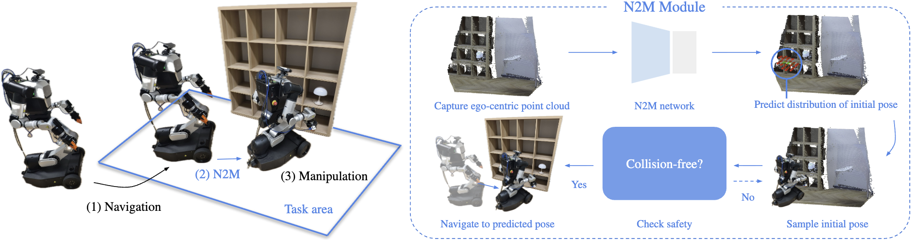

# N2M: Bridging Navigation and Manipulation by Learning Pose Preference from Rollout
<p><a href="https://cckaixin.github.io/myWebsite/">Kaixin Chai</a>*, <a href="https://hjl1013.github.io">Hyunjun Lee</a>*, Joseph J. Lim</p>



This is an official implementation of N2M. We provided detailed instructions to train and inference N2M. For examples in simulation and real world, please refer to `sim` and `real` branches.

## TODOs
- Organize N2M training / inference code ✅
- Organize N2M real world code ✅
- Organize N2M simulation code 

## Installation
Clone and install necessary packages
```bash
git clone --single-branch --branch main https://github.com/clvrai/N2M.git
cd N2M

# install mamba environment
mamba create -n n2m python==3.11
mamba activate n2m
pip install -r requirements.txt
pip install -e .

# compile c++ file
cd scripts/render
mkdir build && cd build
cmake ..
make
```

## 📊 Data preparation


You should first prepare raw data with pairs of local scene and preferable initial pose. Local scene is a point cloud of a scene and you may stitch point clouds using multiple calibrated cameras. In this repo, we do not provide code for capturing the local scene.

The format of raw data should be placed under `datasets` folder in the format below
```
datasets/
└── {dataset name}/
    ├── pcl/
    │   ├── 0.pcd
    │   ├── 1.pcd
    │   └── ...
    └── meta.json
    
```
Replace `{dataset name}` with your own dataset name. `pcl/` folder should include point clouds of your local scene and `meta.json` should include the information of each local scene and the label of the preferable initial pose of each scene. `meta.json` should be in the format as below.
```json
{
    "meta": {
        "T_base_to_cam": [
            [-8.25269110e-02, -5.73057816e-01,  8.15348841e-01,  6.05364230e-04],
            [-9.95784041e-01,  1.45464862e-02, -9.05661474e-02, -3.94417736e-02],
            [ 4.00391906e-02, -8.19385767e-01, -5.71842485e-01,  1.64310488e-00],
            [ 0.00000000e+00,  0.00000000e+00,  0.00000000e+00,  1.00000000e+00]
        ],
        "camera_intrinsic": [
            100.6919557412736, 100.6919557412736, 160.0, 120.0, 320, 240
        ]
    },
    "episodes": [
        {
            "id": 0,
            "file_path": "pcl/0.pcd",
            "pose": [
                3.07151444879416,
                -0.9298766226100992,
                1.5782995419534618
            ],
            "object_position": [
                3.2,
                -0.2,
                1.85
            ]
        },
        ...
    ]
}
```
`T_base_to_cam`: A 4 x 4 transformation matrix that transforms SE(3) pose of base to SE(3) pose of camera. SE(3) pose of base is an SE(2) pose transformed into SE(3) format. This should be pre-calculated and provided to the dataset.

`camera_intrinsic`: The intrinsic of the camera used to capture the point cloud. This should also be provided in the dataset.

`file_path`: Relative path of the corresponding local scene point cloud.

`pose`: Preferable initial pose where you mark the rollout success. Above example is SE(2) pose but you can change it to (x, y, theta, z) information depending on your setting.

`object position`: Position of the object of interest. We later used this to check the visibility of the object when we sample viewpoints. This element is not mandatory as we estimate it as a position 0.5m infront of `pose` with height 1m if it is empty.

Example dataset can be downloaded from this <a href="https://drive.google.com/file/d/1Qd7ImoUXLwbmB8Or8aRH7oPP8tn6YAdf/view?usp=sharing">link</a>

## 🛠️ Data Processing
Now we are ready to process the data. Run the following command to process the data.
```bash
sh scripts/process_dataset.sh "path/to/dataset"
```
This will apply viewpoint augmentation and generate augmented point clouds with new transformed labels corresponding to them. The file structure of the dataset will now look like this:
```
datasets/
└── {dataset name}/
    ├── camera_poses/
    ├── camera_poses_vis/
    ├── pcl/
    ├── pcl_aug/
    ├── meta_aug.json
    └── meta.json
```
You will find the visualization of sampled camera poses per each scene in `camera_poses_vis/`. Augmented point cloud and corresponding labels will be saved in `pcl_aug/` and `meta_aug.json` respectively.

## 🚀 Training
You will be using `configs/training/config.json` as training configuration. Change `dataset_path: "datasets/{dataset name}"` and additional training settings related to your taste

Before running training, download pretrained PointBERT weight from this <a href="https://drive.google.com/file/d/1NquLPcZQcjh4C69EfZLuVlxgVtd6nTf0/view?usp=sharing">link</a> and save it under `models/PointBERT` folder.
```bash
python scripts/train.py --config configs/training/config.json
```
Your training log will saved under `training/{dataset name}`

## 🏃🏻‍♂️‍➡️ Inference
To use N2M, you have to import N2Mmodule from `n2m/module/N2Mmodule.py`. This is a wrapper for N2Mnet with data pre-processing and post-processing. This also contains collision checking for sampling valid initial pose from predicted distribution. Example code is as follows
```python
import json
import o3d
import numpy as np

from n2m.module import N2Mmodule 

# initialize n2m module
config = json.load("configs/inference/config.json")
n2m = N2Mmodule(config)

# load pcd
pcd = o3d.io.read_point_cloud("example.pcd")
pcd_numpy = np.concatenate([np.asarray(pcd.points), np.asarray(pcd.colors)], axis=1)

# predict initial pose. If it fails to sample valid points within certain number of trial, is_valid will return False. Otherwise, is_valid will be True
initial_pose, is_valid = n2m.predict(pcd_numpy)
```